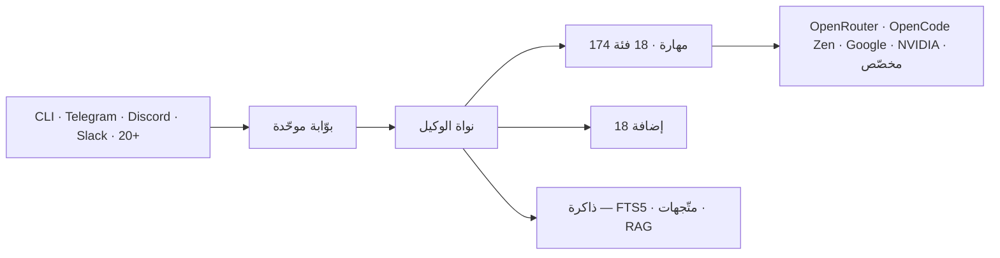

<div align="center">


<br/>

<picture>
  <source media="(prefers-color-scheme: dark)" srcset="assets/banner.gif" />
  
</picture>

<br/><br/>


<br/><br/>

| &nbsp;&nbsp;&nbsp;&nbsp;&nbsp;&nbsp;&nbsp;&nbsp; | &nbsp;&nbsp;&nbsp;&nbsp;&nbsp;&nbsp;&nbsp;&nbsp; | &nbsp;&nbsp;&nbsp;&nbsp;&nbsp;&nbsp;&nbsp;&nbsp; | &nbsp;&nbsp;&nbsp;&nbsp;&nbsp;&nbsp;&nbsp;&nbsp; | &nbsp;&nbsp;&nbsp;&nbsp;&nbsp;&nbsp;&nbsp;&nbsp; |
|:-:|:-:|:-:|:-:|:-:|
| <br/>Python | <br/>FastAPI | <br/>TypeScript | <br/>React | <br/>Flutter |
| <br/>Docker | <br/>SQLite | <br/>Electron | <br/>Telegram | <br/>Discord |

<br/>

<a href="README.md">🌐 English</a> · <a href="#"><b>🇸🇦 العربية</b></a> · <a href="README.zh-CN.md">🇨🇳 中文</a> · <a href="README.es.md">🇪🇸 Español</a>

</div>

<br/>

---

## ◆ ما هو Syriana Agent؟

Syriana Agent وكيلُ ذكاءٍ اصطناعيّ شخصيّ، وُضعَ للمطوّرين والباحثين والمستخدمين المتميّزين الذين يطلبون مساعداً **يتعلّم حقّاً ويذكر**. فبخلاف الوكلاء الأُخرى التي تُمحي ذاكرتها مع انتهاء كلّ محادثة، يحافظ Syriana على **حلقة تعلّم مغلقة** — يصوغ المهارات من الخبرة، ويشحذها مع مرور الوقت، ويبني فهماً أعمق لأسلوبك وتفضيلاتك ونمط عملك.

في صميمه، محركُ وكيلٍ نحيفٍ ذي مخطط أدواتٍ ضيّق. أمّا القدرة الحقيقيّة فتكمن عند أطرافه — في **174 مهارة جاهزة**، و**18 إضافة**، ودعمِ **أكثر من عشرين منصة مراسلة** من عملية بوّابة واحدة.

أنت تجلبُ مفتاحَك. أنت تختارُ مزوّدَك. أنت تملكُ بياناتِك. بلا احتكار، بلا اشتراكات، بلا تتبّع.

<br/>

### ◇ لمحة سريعة

```python
class SyrianaAgent:
    """وكيلُ ذكاءٍ اصطناعيّ ذاتيّ التطوّر، بحلقة تعلّم مغلقة."""

    name       = "Syriana Agent"
    version    = "1.0.0"
    publisher  = "FIXOLOGY Research"
    license    = "MIT"
    motto      = "ذكاؤك. مزوّدك. قواعدك."

    providers  = {
        "OpenRouter":   "أكثر من 200 نموذج — Claude, GPT, Gemini, Llama",
        "OpenCode Zen": "DeepSeek v4 / Nemotron 3 — مجاني",
        "Google AI":    "Gemini 2.5 Pro & Flash",
        "NVIDIA AI":    "5 نماذج مجانية — build.nvidia.com",
        "Custom":       "أيّ نقطة نهاية متوافقة مع OpenAI",
    }

    capabilities = {
        "متعدد المزوّدات": "تبديل المزوّدات بأمرٍ واحد",
        "المهارات":         "174 مهارةً جاهزةً في 18 فئة",
        "الإضافات":         "18 — جدولة · بوّابات · ذاكرة · متصفّح · رؤية",
        "الذاكرة":          "بحث نصّي كامل FTS5 + قاعدة متّجهات + تلخيص ذكي RAG",
        "MCP":              "دعم بروتوكول سياق النموذج",
        "التطوّر الذاتي":    "يصوغ المهارات ويشحذها من التجربة الحيّة",
    }

    stack = {
        "Backend":  "Python · FastAPI · Pydantic · OpenAI SDK",
        "Frontend": "TypeScript · React · Flutter · Electron",
        "Data":     "Supabase · SQLite FTS5 · قاعدة متّجهات",
        "Infra":    "Docker · Linux · macOS · Windows · Android",
    }
```

---

## ◆ بالأرقام

| | | |
|:---:|:---:|:---:|
| 🔹 **174** مهارة | 🔹 **18** إضافة | 🔹 **20** منصة |
| 🔹 **1,869** اختبار | 🔹 **2,802** ملف Python | 🔹 **777** ملف TypeScript |
| 🔹 **1.3M** سطر كود | 🔹 **MIT** رخصة | 🔹 **مجانيّ** للأبد |

---

## ◆ التثبيت

```bash
curl -fsSL https://raw.githubusercontent.com/alwalid-khllo/syriana-agent/main/scripts/install.sh | bash
syriana config set OPENROUTER_API_KEY مفتاحك_هنا
syriana chat
```

<details>
<summary>▸ منصّات أُخرى</summary>

**ويندوز (PowerShell):**
```powershell
powershell -ExecutionPolicy ByPass -c "iex (irm https://raw.githubusercontent.com/alwalid-khllo/syriana-agent/main/scripts/install.ps1)"
```

**أندرويد (Termux):**
```bash
pkg update && pkg install python git curl -y
pip install git+https://github.com/alwalid-khllo/syriana-agent.git --no-deps
```

**بعد التثبيت:**
```bash
syriana gateway run     # تفعيل تلغرام + دسكورد
syriana model           # تبديل المزوّد
syriana update          # آخر إصدار
```
</details>

---

## ◆ تنبيه لمستخدمي ويندوز العرب

> ⚠️ طرفيّة ويندوز الافتراضيّة (cmd و PowerShell) **لا تدعم الكتابة بالعربيّة** على نحوٍ صحيح، فيظهر النصّ مقلوباً أو متقطعاً.
>
> **الحلّ:** ثبّت [ConEmu](https://conemu.github.io/) — طرفيّةٌ مفتوحة المصدر تدعم العربيّة تامّة — ثمّ نفّذ أمر التثبيت من داخلها.

---

## ◆ لماذا Syriana

| الميزة | Syriana | Manus | Cursor | Claude Code |
|--------|:-------:|:-----:|:------:|:-----------:|
| 🔑 تعدّد المزوّدات (بمفاتيحك) | ✅ | ❌ | ❌ | ❌ |
| 🧬 مهارات ذاتيّة التطوّر | ✅ | ❌ | ❌ | ❌ |
| 📚 ذاكرةٌ عابرة للجلسات | ✅ | ❌ | جزئيّ | جزئيّ |
| 🔓 مفتوح المصدر (MIT) | ✅ | ❌ | ❌ | ❌ |
| 💬 تلغرام / دسكورد / سلاك | ✅ | ❌ | ❌ | ❌ |
| 🌐 أكثر من 20 منصّة | ✅ | ❌ | ❌ | ❌ |
| 🔌 دعم MCP | ✅ | ❌ | جزئيّ | ✅ |
| ⏰ وظائفٌ مجدولة | ✅ | ❌ | ❌ | ❌ |
| 🌐 أتمتة المتصفّح | ✅ | ❌ | ❌ | ❌ |
| 📋 لوحات Kanban | ✅ | ❌ | ❌ | ❌ |
| 🎙️ إضافات الصوت والرؤية | ✅ | ❌ | ❌ | ❌ |
| 💲 التكلفة | مجانيّ | 50$/شهر | 20$/شهر | تكلفة API |

---

## ◆ المزوّدات

أيّ مزوّد. مفتاحُك. حريّتُك.

| الفئة | المدعوم |
|-------|---------|
| ☁️ **سحابيّ** | OpenAI · Anthropic · Google · DeepSeek · OpenRouter (+200) · Moonshot · MiniMax · GLM · NVIDIA NIM · Bedrock · Azure · Vertex AI |
| 🏠 **محليّ** | Ollama · LM Studio · vLLM · llama.cpp · أيّ نقطة متوافقة |
| 🆓 **مجانيّ** | Google AI Studio · نماذج OpenRouter المجانيّة · NVIDIA مجانيّ · نماذج محلّيّة |

```bash
syriana model    # اختيار تفاعليّ — بلا تعديل ملفات، بلا إعادة تشغيل
```

---

## ◆ 174 مهارة في 18 فئة

| المجال | العدد | ما تغطّيه |
|--------|:-----:|------|
| 💻 التطوير | 28 | مراجعة الشيفرة · التنقيح · TDD · BDD · هندسة البرمجيّات · إعادة الهيكلة · سير عمل Git · Docker · التكامل والنشر المستمرّ |
| 🔒 الأمن السيبرانيّ | 16 | اختبار الاختراق · الاستخبارات مفتوحة المصدر · البحث عن الثغرات · التحليل الجنائيّ الرقميّ · التحليل الهجوميّ |
| 📊 علوم البيانات والتعلّم الآليّ | 14 | التحليل · التصوّر البيانيّ · دفاتر Jupyter · خطوط التعلّم الآليّ · هندسة الخصائص · تقييم النماذج · معايير النماذج اللغويّة |
| 🎨 الإبداع | 18 | توليد الصور · فنّ ASCII · الفيديو · الموسيقى · Manim CE · p5.js · ComfyUI · الرسوم المعلوماتيّة · المخطّطات المعماريّة |
| 🔬 البحث | 12 | أوراق arXiv · البحث والاستخراج من الويب · تحليل يوتيوب · مراقبة المدوّnews وRSS · تتبّع الأخبار · Polymarket |
| 📝 الإنتاجيّة | 16 | البريد الإلكترونيّ · Google Workspace · Notion · Airtable · العروض التقديميّة · الاستخراج الضوئيّ · الجداول · تحرير PDF |
| 🤖 MLOps | 12 | تشغيل النماذج (vLLM) · استنتاج GGUF · HuggingFace Hub · تقييم النماذج · المحلّلات اللغويّة · تسجيل الأوزان والأوزان |
| 💬 التواصل | 20 | تلغرام · دسكورد · سلاك · واتساب · سيغنال · البريد الإلكترونيّ · الرسائل القصيرة · WeChat · Matrix · Teams · تسعة أُخرى |
| 🏠 البيت الذكيّ | 3 | Philips Hue · openHue · إدارة المشاهد |
| 📱 وسائل التواصل الاجتماعيّ | 3 | X/Twitter · النشر · البحث · الوسائط |
| 📈 التداول | 1 | بنية التداول الكمّيّ |
| 📓 تدوين الملاحظات | 2 | Obsidian · تخطيط الأبحاث |
| 🎬 الوسائط | 4 | البحث عن GIF · محتوى يوتيوب · ميزات صوتيّة · توليد الأغاني |
| 🐙 GitHub | 6 | إدارة المستودعات · سير عمل الطلبات · مراجعة الشيفرة · القضايا · تصميم README |
| ☁️ DevOps | 8 | الخوادم السحابيّة · إدارة Discord · لوحات العمليات · GCP · Android Termux |
| 📖 اللغويّات | 9 | النحو العربيّ · الصرف · اللسانيّات · البلاغة · نظريّة لغات البرمجة |
| 🔗 MCP والوكلاء | 7 | كتالوج MCP · أسراب الوكلاء · تفويض الوكلاء الفرعيّين · هندسة السياق |
| 🛡️ الأمن الهجوميّ | 6 | اختبار الاختراق المصرّح · الفريق الأحمر · اختبار الاختراق |

---

## ◆ 18 إضافة

| الإضافة | وظيفتها |
|---------|---------|
| 🌐 المتصفّح | أتمتة الويب عبر Playwright — التصفّح · الاستخراج · التفاعل |
| 🧠 محرّك السياق | إدارة ذكيّة للسياق — ضغط · أولويّة · تخزين مؤقّت |
| ⏰ الجدولة | وظائفٌ مجدولة — ملخّصات يوميّة · نسخ احتياطيّ · مراقبة |
| 🔐 مصادقة لوحة التحكّم | التحكّم بالوصول إلى لوحة التحكّم веб |
| 💾 تنظيف القرص | إدارة تلقائيّة لمساحة القرص وتدوير السجلات |
| 📹 Google Meet | بوت اجتماعات للنسخ والتلخيص |
| 🖼️ توليد الصور | نصّ إلى صورة عبر FAL.ai و OpenAI و xAI |
| 📋 Kanban | إدارة المهام والمشاريع بلوحات مرئيّة |
| 🧩 الذاكرة | ذاكرة متعدّدة الخلفيّات: mem0 · Honcho · Supermemory · RetainDB · OpenViking |
| 🔌 مزوّدات النماذج | تجريد المزوّدات المتوافقة مع OpenAI مع التوجيه |
| 📊 المراقبة | Langfuse · Nemo Relay — تتبّع · سجلّات · تحليلات |
| 📡 المنصّات | 20 محوّل منصّة (تلغرام · دسكورد · سلاك · واتساب...) |
| 🛡️ الإرشاد الأمنيّ | كشف الأنماط الأمنيّة والتحذير الفوريّ |
| 🎵 Spotify | تكامل Spotify — البحث · التشغيل · القوائم |
| 🏆 الإنجازات | تتبّع المراحل ونظام إنجازات المستخدم |
| 📋 خطّ Teams | تلخيص اجتماعات Microsoft Teams |
| 🎥 توليد الفيديو | نصّ إلى فيديو عبر FAL.ai |
| 🔍 الويب | البحث والاستخراج ومراقبة محتوى الويب |

---

## ◆ البنية



---

## ◆ ما يميّز Syriana

### 🔄 حلقة تعلّم مغلقة
جلّ الوكلاء صدفةٌ بلا ذاكرة — تنتهي المحادثة فيُنسى كلّ شيء. أمّا Syriana فيذكر. يصوغ المهارات من المهامّ المعقّدة، ويشحذها مع كلّ استخدام، ويبني نموذجاً متعمّقاً لتفضيلاتك.

### 🔑 الحرّيّة من المزوّد في صميم البنية
ليس إضافةً مُلحقة. كلّ استدعاء API يمرّ عبر طبقة التجريد نفسها. انتقل من Claude إلى Gemini إلى DeepSeek بأمرٍ واحد. بلا احتكار.

### 🔹 نواة ضيّقة · أطراف واسعة
نواة الوكيل نحيفةٌ عمداً (~5,000 سطر). كلّ أداة تُرسل مع كلّ استدعاء API، لذا فالمعيار للأدوات الأساسيّة مرتفع. جلّ القدرة الجديدة تصل كمهارة أو إضافة أو خادم MCP. وهذا يجعل تخزين السياق مستقرّاً والتكاليف قابلةً للتوقّع.

### 🌍 يعمل في كلّ مكان
انشره على خادمٍ بخمسة دولارات، أو حاوية Docker، أو سحابة، أو بنيةٍ بدون خادم. تواصل من طرفيّتك أو هاتفك (تلغرام) أو دردشة الفريق (دسكورد/سلاك) أو تطبيق سطح المكتب (Electron). ملف إعداداتٍ واحد · عمليّة بوّابة واحدة · كلّ المنصّات متّصلة.

---

## ◆ انضمّ إلى المجتمع

<div align="center">

### [📲 انضمّ إلى مجتمع Syriana AI على تلغرام](https://t.me/syriana_ai)

أسئلة · أفكار · مساهمات · كلّ المستويات مرحب بها

<br/>

[🐛 بلّغ عن خلل](https://github.com/alwalid-khllo/syriana-agent/issues) ·
[📝 قدّم طلب دمج](https://github.com/alwalid-khllo/syriana-agent/pulls) ·
[💬 نقاشات](https://github.com/alwalid-khllo/syriana-agent/discussions)

</div>

---

<div align="center">

**🔓 رخصة MIT · أنشأته FIXOLOGY Research**

<br/><br/>


</div>
