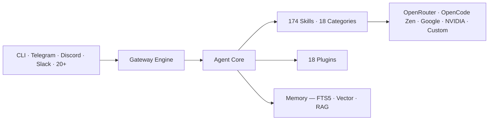

<div align="center">


<br/>

<picture>
  <source media="(prefers-color-scheme: dark)" srcset="assets/banner.gif" />
  
</picture>

<br/><br/>


<br/><br/>

| &nbsp;&nbsp;&nbsp;&nbsp;&nbsp;&nbsp;&nbsp;&nbsp; | &nbsp;&nbsp;&nbsp;&nbsp;&nbsp;&nbsp;&nbsp;&nbsp; | &nbsp;&nbsp;&nbsp;&nbsp;&nbsp;&nbsp;&nbsp;&nbsp; | &nbsp;&nbsp;&nbsp;&nbsp;&nbsp;&nbsp;&nbsp;&nbsp; | &nbsp;&nbsp;&nbsp;&nbsp;&nbsp;&nbsp;&nbsp;&nbsp; |
|:-:|:-:|:-:|:-:|:-:|
| <br/>Python | <br/>FastAPI | <br/>TypeScript | <br/>React | <br/>Flutter |
| <br/>Docker | <br/>SQLite | <br/>Electron | <br/>Telegram | <br/>Discord |

<br/>

<a href="#english">🌐 English</a> · <a href="README.ar.md">🇸🇦 العربية</a> · <a href="README.zh-CN.md">🇨🇳 中文</a> · <a href="README.es.md">🇪🇸 Español</a> · <a href="README.ur-pk.md">🇵🇰 اردو</a>

</div>

<br/>

---

## ◆ What is Syriana Agent?

Syriana is a personal AI agent designed for developers, researchers, and power users who want an assistant that **actually learns and remembers**. Unlike agents that reset to zero after each session, Syriana maintains a closed learning loop — creating skills from experience, refining them over time, and building a deepening understanding of your workflow, preferences, and patterns.

At its core, Syriana is a thin agent engine with a narrow tool schema. All capability lives at the edges — in its **174 pre-built skills**, **18 plugins**, and support for **20+ messaging platforms** from a single gateway process.

You bring your own API key. You choose any provider. You own every piece of data. No lock-in, no subscriptions, no telemetry.

<br/>

### ◇ At a glance

```python
class SyrianaAgent:
    """A self‑improving AI agent with a closed learning loop."""

    name       = "Syriana Agent"
    version    = "1.0.0"
    publisher  = "FIXOLOGY Research"
    license    = "MIT"
    motto      = "Your AI. Your Provider. Your Rules."

    providers  = {
        "OpenRouter":   "200+ models — Claude, GPT, Gemini, Llama",
        "OpenCode Zen": "DeepSeek v4 / Nemotron 3 — free",
        "Google AI":    "Gemini 2.5 Pro & Flash",
        "NVIDIA AI":    "5 free models — build.nvidia.com",
        "Custom":       "Any OpenAI‑compatible endpoint",
    }

    capabilities = {
        "Multi-Provider":   "Hot‑swap providers with one command",
        "Skills":           "174 pre‑built across 18 categories",
        "Plugins":          "18 — cron, memory, gateways, browser, vision",
        "Memory":           "FTS5 search + Vector DB + RAG summarization",
        "MCP":              "Model Context Protocol support",
        "Self-Evolving":    "Creates & refines skills from experience",
    }
```

---

## ◆ By the Numbers

| | | |
|:---:|:---:|:---:|
| 🔹 **174** Skills | 🔹 **18** Plugins | 🔹 **20** Platforms |
| 🔹 **1,869** Tests | 🔹 **2,802** Python files | 🔹 **777** TypeScript files |
| 🔹 **1.3M** Lines of code | 🔹 **MIT** License | 🔹 **Free** forever |

---

## ◆ Download & Install

> One command for each platform. No complex setup. Just copy, paste, and run.

<div align="center">

| | Platform | Command |
|:---:|---|---|
| <br/>**Linux** | Debian · Ubuntu · Fedora · Arch · WSL | `curl -fsSL https://raw.githubusercontent.com/alwalid-khllo/syriana-agent/main/scripts/install.sh \| bash` |
| <br/>**macOS** | Intel & Apple Silicon | `curl -fsSL https://raw.githubusercontent.com/alwalid-khllo/syriana-agent/main/scripts/install.sh \| bash` |
| <br/> | 10 / 11 | `powershell -ExecutionPolicy ByPass -c "iex (irm https://raw.githubusercontent.com/alwalid-khllo/syriana-agent/main/scripts/install.ps1)"` |
| <br/>**Termux** | Android (F-Droid) | `pkg update && pkg install python git curl -y && pip install git+https://github.com/alwalid-khllo/syriana-agent.git --no-deps` |

</div>

<br/>

### ⚠️ Windows Users — Arabic (RTL) Support

The default Windows terminal (cmd / PowerShell) **does not support Arabic (RTL)** input. Text appears reversed or broken.

**Fix:** Install [**ConEmu**](https://conemu.github.io/) — a free, open-source terminal with full Arabic RTL support — then run the PowerShell install command inside it:

```powershell
# Inside ConEmu — paste and run:
powershell -ExecutionPolicy ByPass -c "iex (irm https://raw.githubusercontent.com/alwalid-khllo/syriana-agent/main/scripts/install.ps1)"
```

<br/>

### ◆ After Install

```bash
syriana gateway run     # activate Telegram + Discord
syriana model           # switch providers interactively
syriana update          # update to latest version
```

---

## ◆ Why Syriana

| Capability | Syriana | Manus | Cursor | Claude Code |
|------------|:-------:|:-----:|:------:|:-----------:|
| 🔑 Multi-provider (your keys) | ✅ | ❌ | ❌ | ❌ |
| 🧬 Self-evolving skills | ✅ | ❌ | ❌ | ❌ |
| 📚 Cross-session memory | ✅ | ❌ | partial | partial |
| 🔓 Open source (MIT) | ✅ | ❌ | ❌ | ❌ |
| 💬 Telegram / Discord / Slack | ✅ | ❌ | ❌ | ❌ |
| 🌐 20+ platform channels | ✅ | ❌ | ❌ | ❌ |
| 🔌 MCP support | ✅ | ❌ | partial | ✅ |
| ⏰ Built-in cron automation | ✅ | ❌ | ❌ | ❌ |
| 🌐 Browser automation | ✅ | ❌ | ❌ | ❌ |
| 📋 Kanban boards | ✅ | ❌ | ❌ | ❌ |
| 🎙️ Voice & vision plugins | ✅ | ❌ | ❌ | ❌ |
| 💲 Cost | free | $50/mo | $20/mo | API cost |

---

## ◆ Provider-Agnostic

Syriana works with any OpenAI-compatible API. Your keys, your choice, your freedom.

| Tier | Providers |
|------|-----------|
| ☁️ **Cloud** | OpenAI · Anthropic · Google · DeepSeek · OpenRouter (200+) · Moonshot · MiniMax · GLM · NVIDIA NIM · Bedrock · Azure · Vertex AI |
| 🏠 **Local** | Ollama · LM Studio · vLLM · llama.cpp · any compatible endpoint |
| 🆓 **Free** | Google AI Studio · OpenRouter free models · NVIDIA free tier · local models (zero cost) |

```bash
syriana model    # interactive picker — no config edits, no restarts
```

---

## ◆ 174 Skills Across 18 Categories

| Category | # | What it covers |
|----------|:---:|---------------|
| 💻 Development | 28 | code review · debugging · TDD · BDD · architecture · refactoring · Git workflows · Docker · CI/CD · monitoring |
| 🔒 Cybersecurity | 16 | pentesting · OSINT · vulnerability research · forensics · fuzzing · exploit analysis · red teaming · APK analysis |
| 📊 Data Science & ML | 14 | analysis · visualization · Jupyter · ML pipelines · feature engineering · model evaluation · LLM benchmarks |
| 🎨 Creative | 18 | image generation · ASCII art · video · music · Manim CE · p5.js · ComfyUI · infographics · architecture diagrams |
| 🔬 Research | 12 | arXiv · web search · YouTube · blog & RSS monitoring · news tracking · Polymarket |
| 📝 Productivity | 16 | email · Google Workspace · Notion · Airtable · presentations · OCR · spreadsheets · PDF editing |
| 🤖 MLOps | 12 | model serving (vLLM) · GGUF inference · HuggingFace Hub · model evaluation · tokenizers · W&B logging |
| 💬 Communication | 20 | Telegram · Discord · Slack · WhatsApp · Signal · Email · SMS · WeChat · Matrix · Teams · +9 more |
| 🏠 Smart Home | 3 | Philips Hue · openHue CLI · scene management |
| 📱 Social Media | 3 | X/Twitter · posting · search · media |
| 📈 Trading | 1 | quantitative trading infrastructure |
| 📓 Note Taking | 2 | Obsidian vault · research planning |
| 🎬 Media | 4 | GIF search · YouTube content · audio features · song generation |
| 🐙 GitHub | 6 | repo management · PR workflow · code review · issues · README design |
| ☁️ DevOps | 8 | cloud VPS · Discord server admin · ops dashboards · GCP · Android Termux |
| 📖 Linguistics | 9 | Arabic grammar · morphology · linguistics · rhetoric · programming language theory |
| 🔗 MCP & Agents | 7 | MCP catalog · agent fleets · subagent delegation · context engineering |
| 🛡️ Security & Offensive | 6 | authorized pentesting · red teaming · jailbreak testing |

---

## ◆ 18 Plugins

| Plugin | What it does |
|--------|-------------|
| 🌐 Browser | Playwright web automation — navigation, scraping, interaction |
| 🧠 Context Engine | Smart context management — compression, prioritization, caching |
| ⏰ Cron | Scheduled jobs — daily briefs, backups, monitoring, automation |
| 🔐 Dashboard Auth | Web dashboard authentication and access control |
| 💾 Disk Cleanup | Automatic disk space management and log rotation |
| 📹 Google Meet | Meet bot for transcription and meeting summaries |
| 🖼️ Image Generation | Text-to-image via FAL.ai, OpenAI, xAI |
| 📋 Kanban | Task and project management with board-based workflow |
| 🧩 Memory | Multi-backend: mem0, Honcho, Supermemory, RetainDB, OpenViking |
| 🔌 Model Providers | OpenAI-compatible provider abstraction with routing |
| 📊 Observability | Langfuse, Nemo Relay — tracing, logging, analytics |
| 📡 Platforms | 20 messaging platform adapters |
| 🛡️ Security Guidance | Real-time security pattern detection |
| 🎵 Spotify | Spotify API — search, playback, playlists |
| 🏆 Achievements | Milestone tracking and user achievements |
| 📋 Teams Pipeline | Microsoft Teams meeting summaries |
| 🎥 Video Generation | Text-to-video via FAL.ai |
| 🔍 Web | Web search, extraction, content monitoring |

---

## ◆ Architecture



---

## ◆ What Makes Syriana Different

### 🔄 Closed Learning Loop
Most agents are stateless shells — the conversation ends, everything is forgotten. Syriana remembers. It creates skills from complex tasks, refines them during use, and builds a model of your preferences over time.

### 🔑 Provider Agnostic at the DNA Level
Not bolted-on. Not a plugin. Every API call routes through the same abstraction layer. Switch from Claude to Gemini to DeepSeek in one command. Zero lock-in.

### 🔹 Narrow Core, Wide Edges
The agent core is intentionally thin (~5,000 lines). Every tool ships on every API call, so the bar for core tools is high. Most new capability arrives as a skill, a plugin, or an MCP server. This keeps prompt caching stable and costs predictable.

### 🌍 Runs Anywhere
Deploy on a $5 VPS, a Docker container, a cloud VM, or serverless. Connect from your terminal, phone (Telegram), team chat (Discord/Slack), or desktop app (Electron). One config file, one gateway process, every platform connected.

---

## ◆ For Arabic Users on Windows

> ⚠️ The default Windows terminal (cmd / PowerShell) does not support Arabic (RTL) text input properly.
>
> **Fix:** Install [ConEmu](https://conemu.github.io/) — a free, open-source terminal with full Arabic RTL support — then run the install command from inside it.

---

## ◆ Join the Community

<div align="center">

### [📲 Join Syriana AI on Telegram](https://t.me/syriana_ai)

Questions · Ideas · Contributions · All levels welcome

<br/>

[🐛 Report a bug](https://github.com/alwalid-khllo/syriana-agent/issues) ·
[📝 Submit a PR](https://github.com/alwalid-khllo/syriana-agent/pulls) ·
[💬 Discussions](https://github.com/alwalid-khllo/syriana-agent/discussions)

</div>

---

<div align="center">

## 🇸🇦  للمستخدمين العرب

<br/>

**Syriana Agent** — وكيل ذكاء اصطناعي شخصي يتعلم من كل تجربة. 174 مهارة جاهزة · 18 إضافة · +20 منصة · مفتوح المصدر بالكامل.

```bash
curl -fsSL https://raw.githubusercontent.com/alwalid-khllo/syriana-agent/main/scripts/install.sh | bash
syriana config set OPENROUTER_API_KEY مفتاحك_هنا
syriana chat
```

<details>
<summary>⚠️ لمستخدمي ويندوز العرب</summary>

التيرمينال الافتراضي في ويندوز لا يدعم الكتابة بالعربية (RTL). ثبّت [ConEmu](https://conemu.github.io/) أولاً ثم نفّذ الأمر من داخله.
</details>

📖 [الوثائق الكاملة بالعربية](README.ar.md) · 📲 [مجتمع تلغرام](https://t.me/syriana_ai)

</div>

---

<div align="center">

**🔓 MIT License · Built by FIXOLOGY Research**

<br/><br/>


</div>
